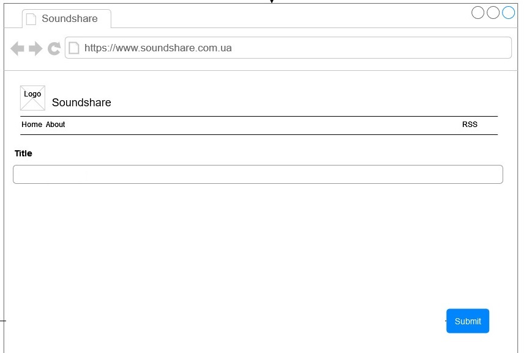
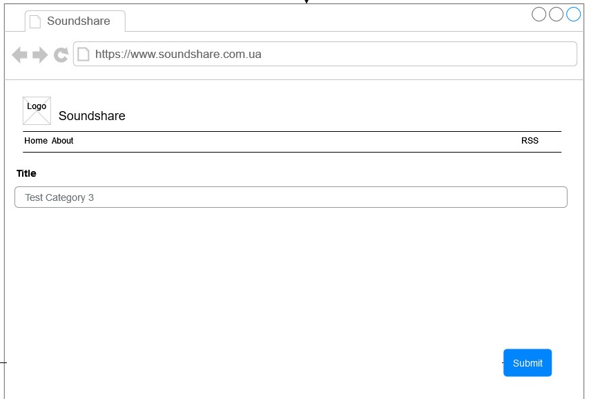
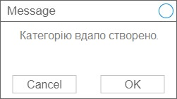

|NFR id|Test Case id|Опис кроків тестового сценарію|Опис очікуваних результатів|
|:-:|:-:|:-|:-:|
|NFR1.1|TC1.5|Початкові умови: Відсутні.   Кроки сценарію: Відсутні.|
|NFR1.1|TC1.6|Початкові умови: Успішно пройдений TC1.5   Кроки сценарію:   1) В поле Title (назва) внесено значення Test Category 3|
|NFR1.1|TC1.7|Початкові умови: успішно пройдено TC1.6   Кроки сценарію:   1) Натиснуто кнопку Submit (відправити).|

